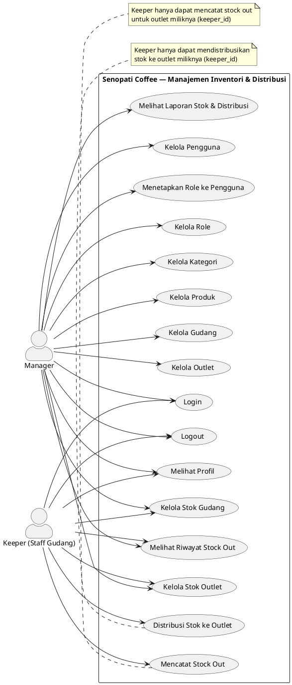
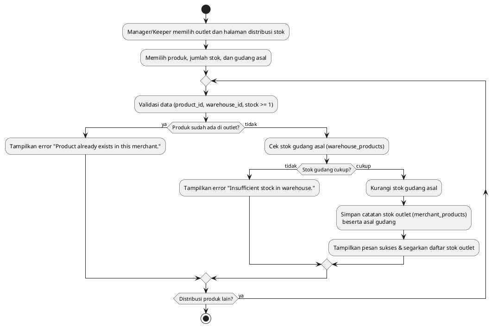
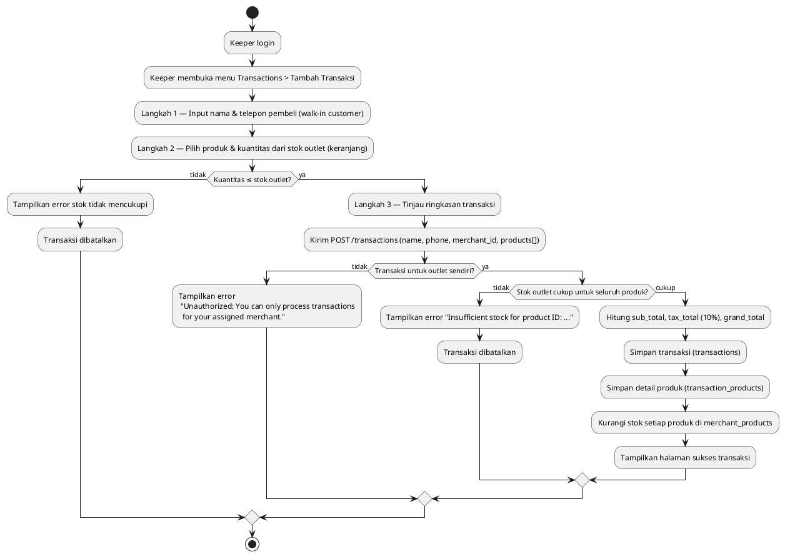
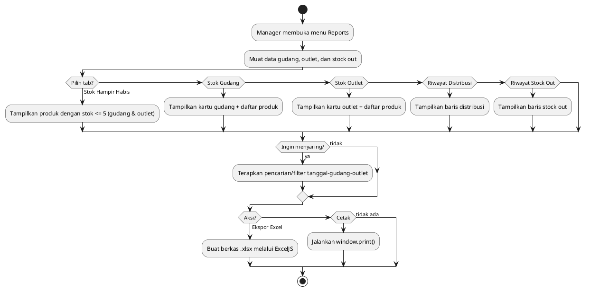
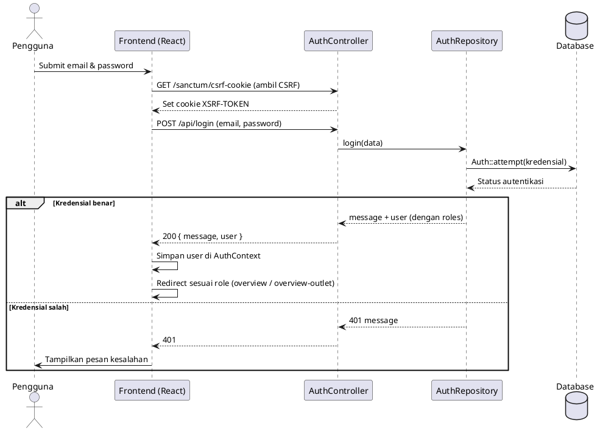
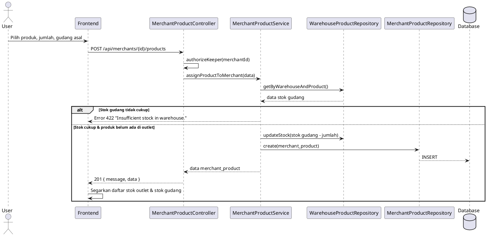
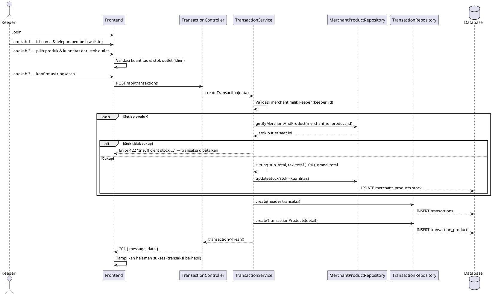
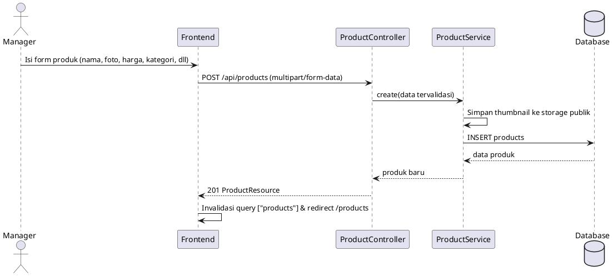
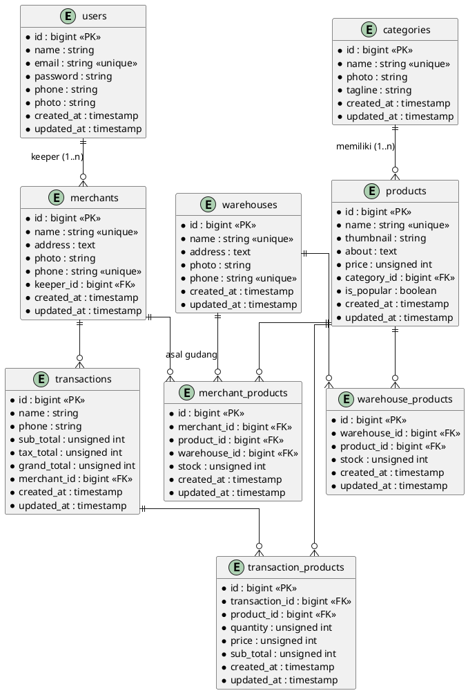
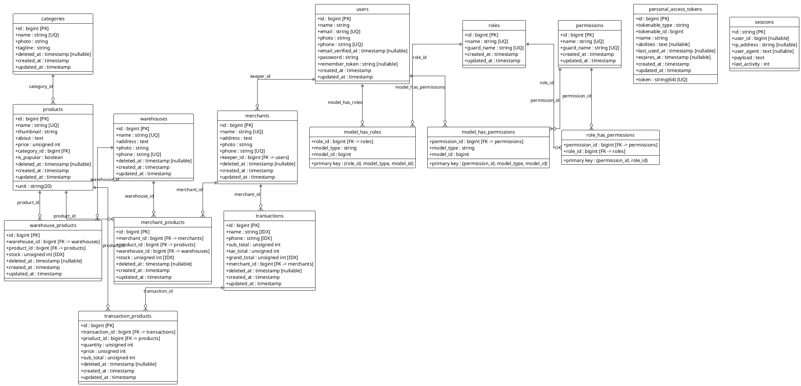

# DOKUMENTASI PROYEK SENOPATI COFFEE
## Senopati Coffee — Inventory & Distribution System

**Versi Dokumen:** 1.0
**Tanggal:** 31 Juli 2026
**Disusun Berdasarkan:** Analisis menyeluruh *source code* backend dan frontend (tanpa mengubah kode program, database, maupun *business logic*).

---

## DAFTAR ISI

1. [Gambaran Sistem](#bab-1-gambaran-sistem)
2. [Persyaratan Sistem](#bab-2-persyaratan-sistem)
3. [Cara Instalasi](#bab-3-cara-instalasi)
4. [Struktur Folder](#bab-4-struktur-folder)
5. [Peran Pengguna (Role)](#bab-5-peran-pengguna-role)
6. [Fitur-Fitur Aplikasi](#bab-6-fitur-fitur-aplikasi)
7. [Use Case Diagram](#bab-7-use-case-diagram)
8. [Activity Diagram](#bab-8-activity-diagram)
9. [Sequence Diagram](#bab-9-sequence-diagram)
10. [Class Diagram](#bab-10-class-diagram)
11. [Entity Relationship Diagram (ERD)](#bab-11-entity-relationship-diagram-erd)
12. [Database Diagram](#bab-12-database-diagram)
13. [Dokumentasi API](#bab-13-dokumentasi-api)
14. [Alur Sistem](#bab-14-alur-sistem)
15. [Deployment](#bab-15-deployment)
16. [Catatan dan Temuan](#bab-16-catatan-dan-temuan)

---

## BAB 1. GAMBARAN SISTEM

### 1.1 Nama dan Tujuan

**Senopati Coffee** adalah aplikasi web berbasis arsitektur *frontend-backend* (monolith terpisah) yang digunakan sebagai sistem internal perusahaan untuk mengelola inventori, distribusi stok, dan transaksi penjualan pada jaringan *coffee shop* Senopati Coffee dengan banyak cabang (outlet). Sistem menangani dua tingkatan manajemen:

1. **Tingkat pusat (Manager)** — mengelola gudang pusat, produk, kategori, outlet (cabang), pengguna, role/permission, distribusi stok dari gudang ke outlet, serta melihat laporan stok dan distribusi.
2. **Tingkat outlet (Keeper)** — mengelola stok outlet miliknya, menerima distribusi stok dari gudang, mencatat stock out, dan melihat laporan stok outlet-nya.

### 1.2 Arsitektur Sistem

Sistem dibangun dengan pola **Client-Server** dua komponen:

| Komponen | Teknologi | Peran |
|---|---|---|
| **Frontend** | React 19, Vite 8, TypeScript, TanStack Query 5, React Router DOM v7, Axios, Zod, ExcelJS | Antarmuka pengguna (SPA) |
| **Backend** | Laravel 12 (PHP ^8.2), Laravel Sanctum, Spatie Laravel Permission | REST API, autentikasi, otorisasi, business logic, database |

Backend menerapkan pola arsitektur berlapis **Controller → Service → Repository → Model** untuk seluruh modul utama. Autentikasi menggunakan **Laravel Sanctum** (mode *stateful API*/session) dengan proteksi CSRF; otorisasi berbasis **role** menggunakan paket **Spatie Laravel Permission**.

### 1.3 Istilah Domain

| Istilah Backend | Istilah Frontend | Keterangan |
|---|---|---|
| Merchant | Outlet | Cabang/gerai *coffee shop* yang dikelola oleh seorang *keeper* |
| Keeper | Keeper (Staff Gudang) | Staff gudang yang bertanggung jawab atas satu outlet |
| Warehouse Product | Stok Gudang | Stok produk yang tersimpan di gudang |
| Merchant Product | Stok Outlet / Distribusi Stok | Stok produk pada outlet beserta asal gudang |

> Catatan: API backend tetap menggunakan istilah `merchants` dan `my-merchant`, sedangkan antarmuka pengguna menampilkan istilah **Outlet**. Kedua istilah ini merujuk pada entitas yang sama.

### 1.4 Alur Bisnis End-to-End

Sistem bekerja sebagai rantai aliran stok (inventory chain) dari gudang hingga stock out di outlet:

```
Produk & Kategori (Manager)
  → Barang Masuk / Tambah Stok (Keeper)
  → Stok Gudang
  → Distribusi ke Outlet (Keeper — stok gudang berkurang, stok outlet bertambah)
  → Stok Outlet
  → Stock Out — Pengeluaran Stok (Keeper — stok outlet berkurang)
  → Laporan (Manager)
```

1. **Produk dan kategori** didaftarkan oleh Manager.
2. **Barang masuk gudang (Tambah Stok)**: stok produk dari *supplier* dimasukkan ke **gudang pusat** melalui fitur *assign* stok gudang (stok gudang bertambah). *Catatan: sistem belum memiliki entitas Supplier; "barang masuk gudang" dimodelkan langsung sebagai penambahan stok gudang.*
3. **Distribusi**: Keeper menyalurkan stok dari gudang ke outlet miliknya. Sistem otomatis **mengurangi stok gudang** dan menambah/mencatat stok outlet (menyimpan asal gudang).
4. **Stock Out**: Keeper mencatat pengeluaran stok dari outlet (mis. rusak/kadaluarsa/pemakaian internal). Sistem memeriksa kecukupan **stok outlet**, lalu **mengurangi stok outlet** secara otomatis.
5. **Pelaporan**: Manager dapat melihat ringkasan stok gudang, stok outlet, produk hampir habis, riwayat distribusi, dan riwayat stock out, serta mengekspornya ke Excel.

> **Catatan:** Modul Transaksi Penjualan (backend: `transactions` + `transaction_products`) tetap tersedia di backend namun **dinonaktifkan dari UI**. Tidak ada menu, dashboard, atau halaman laporan yang menampilkan data transaksi penjualan.

### 1.5 Teknologi dan Dependensi Utama

**Frontend (`package.json`):**

- Runtime: `react ^19.0.0`, `react-dom ^19.0.0`
- Routing: `react-router-dom ^7.5.0`
- Data fetching: `@tanstack/react-query ^5.72.0`, `axios ^1.8.4`
- Validasi form: `zod ^3.24.2`, `@hookform/resolvers ^5.0.1`
- Notifikasi: `react-hot-toast ^2.5.2`
- Ekspor Excel: `exceljs ^4.4.0`
- Build tool: `vite ^8.1.4`, `@vitejs/plugin-react-swc ^4.3.1`
- Bahasa: `typescript ~5.7.2`

**Backend (`composer.json`):**

- `php ^8.2`
- `laravel/framework ^12.0`
- `laravel/sanctum ^4.0`
- `spatie/laravel-permission ^6.16`
- `laravel/tinker ^2.10.1`
- Dev: `phpunit ^11.5.3`, `laravel/pint`, `laravel/sail`, `fakerphp/faker`

---

## BAB 2. PERSYARATAN SISTEM

### 2.1 Persyaratan Perangkat Keras (Minimum Rekomendasi)

| Komponen | Spesifikasi |
|---|---|
| Prosesor | Intel Core i3 / AMD setara atau lebih tinggi |
| RAM | 4 GB (disarankan 8 GB) |
| Penyimpanan | 10 GB ruang kosong |
| Jaringan | Koneksi internet untuk instalasi dependensi |

### 2.2 Persyaratan Perangkat Lunak

**Untuk Backend (Laravel):**

| Komponen | Versi |
|---|---|
| PHP | ^8.2 |
| Composer | 2.x |
| Web Server | Apache/Nginx (atau `php artisan serve` untuk pengembangan) |
| Database | MySQL 8 (atau kompatibel), atau SQLite |
| Ekstensi PHP | `openssl`, `pdo`, `mbstring`, `tokenizer`, `xml`, `ctype`, `json`, `fileinfo` |

**Untuk Frontend (React/Vite):**

| Komponen | Versi |
|---|---|
| Node.js | 20.x atau lebih baru (mendukung Vite 8) |
| npm | 10.x atau lebih baru |

### 2.3 Persyaratan Konfigurasi

- Backend dijalankan pada **port 8000** (`http://localhost:8000`), sesuai `baseURL` frontend di `src/api/axiosConfig.ts`.
- Frontend dijalankan pada **port 5173** (`http://localhost:5173`), sesuai `allowed_origins` pada `config/cors.php` backend.
- Koneksi database: lihat berkas `.env` backend (contoh pada `.env.example`: MySQL, database `mondaybwabackend`, user `root`).

---

## BAB 3. CARA INSTALASI

> Langkah-langkah berikut merupakan prosedur instalasi standar yang disusun berdasarkan berkas konfigurasi dan *script* yang ada pada kedua proyek.

### 3.1 Instalasi Backend (Laravel)

1. **Kloning/salin proyek** backend, lalu masuk ke direktori proyek.
2. **Pasang dependensi Composer:**
   ```
   composer install
   ```
3. **Buat berkas lingkungan:**
   ```
   copy .env.example .env
   ```
4. **Buat kunci aplikasi:**
   ```
   php artisan key:generate
   ```
5. **Konfigurasi database** pada berkas `.env`:
   ```
   DB_CONNECTION=mysql
   DB_HOST=127.0.0.1
   DB_PORT=3306
   DB_DATABASE=mondaybwabackend
   DB_USERNAME=root
   DB_PASSWORD=
   ```
6. **Jalankan migrasi dan seeder** (membuat tabel beserta data demo lengkap: 2 role, 1 manajer + 3 penjaga gudang, 15 kategori, 33 produk, 1 gudang, 3 outlet, 81 baris distribusi, 54 record stock out, dan 150 transaksi penjualan):
   ```
   php artisan migrate:fresh --seed
   ```
   > **Akun demo (password semua: `password123`):** manajer `manager@senopaticoffee.id`, penjaga gudang `keeper1@senopaticoffee.id` s.d. `keeper3@senopaticoffee.id`. Seeder menjamin konsistensi stok (stok gudang/outlet akhir sesuai target, tidak ada stok negatif) dan sengaja menyisakan stok hampir habis (≤5) untuk menguji laporan.
7. **Buat tautan penyimpanan** untuk mengakses berkas unggahan/foto:
   ```
   php artisan storage:link
   ```
8. **Jalankan server pengembangan:**
   ```
   php artisan serve
   ```
   Server API tersedia di `http://localhost:8000`.

> **Catatan:** Sesi menggunakan driver `database` (`SESSION_DRIVER=database`), sehingga tabel sesi dibuat otomatis melalui migrasi bawaan Laravel.

### 3.2 Instalasi Frontend (React + Vite)

1. **Kloning/salin proyek** frontend, lalu masuk ke direktori proyek.
2. **Pasang dependensi npm:**
   ```
   npm install
   ```
3. **Jalankan server pengembangan:**
   ```
   npm run dev
   ```
   Aplikasi tersedia di `http://localhost:5173`.

> URL API sudah diatur di `src/api/axiosConfig.ts` (`baseURL: "http://localhost:8000/api"`) dan CORS backend sudah mengizinkan origin `http://localhost:5173` dengan `supports_credentials = true`.

### 3.3 Akun Awal (Seeder)

Seeder menghasilkan seluruh data demo secara otomatis. Kata sandi semua akun adalah **`password123`**:

| Email | Role | Nama |
|---|---|---|
| `manager@senopaticoffee.id` | `manager` | Bayu Prasetyo |
| `keeper1@senopaticoffee.id` | `keeper` | Rizky Aditya Ramadhan |
| `keeper2@senopaticoffee.id` | `keeper` | Salsabila Putri |
| `keeper3@senopaticoffee.id` | `keeper` | Fajar Nugroho |

Selain akun di atas, seeder mengisi 15 kategori, 33 produk, 1 gudang pusat, 3 outlet (Senopati Coffee Setia Budi, Medan Johor, Ring Road — seluruhnya di Medan), 81 baris distribusi, 54 record stock out, dan 150 transaksi penjualan.

---

## BAB 4. STRUKTUR FOLDER

### 4.1 Struktur Frontend (`mondayfedummyui-edited-main`)

```
mondayfedummyui-edited-main/
├── index.html                        # Dokumen HTML utama (title: Senopati Coffee)
├── package.json                      # Manifes dependensi & skrip npm
├── vite.config.ts                    # Konfigurasi Vite (plugin React SWC)
├── public/
│   └── assets/                       # Gambar ikon, logo, aset statis
├── docs/
│   └── DOKUMENTASI.md                # Dokumentasi proyek (dokumen ini)
└── src/
    ├── main.tsx                      # Titik masuk aplikasi
    ├── App.tsx                       # Definisi seluruh rute aplikasi
    ├── api/
    │   ├── axiosConfig.ts            # Instance axios + baseURL + interceptor CSRF
    │   └── authService.ts            # Layanan autentikasi (login/logout/fetchUser)
    ├── components/
    │   ├── Sidebar.tsx               # Navigasi utama (menu per role)
    │   └── UserProfileCard.tsx       # Kartu profil pengguna
    ├── context/
    │   ├── AuthContext.tsx           # Konteks autentikasi
    │   └── TransactionContext.tsx    # Konteks transaksi (keranjang)
    ├── providers/
    │   ├── AuthProvider.tsx          # Provider autentikasi
    │   └── TransactionProvider.tsx   # Provider transaksi
    ├── routes/
    │   └── ProtectedRoute.ts         # Proteksi rute berdasarkan role
    ├── hooks/
    │   ├── useAuth.ts                # Hook akses konteks autentikasi
    │   ├── useRoleRedirect.ts        # Pengalihan berbasis role
    │   ├── useCategories.ts          # API kategori (CRUD)
    │   ├── useProducts.ts            # API produk (CRUD)
    │   ├── useWarehouses.ts          # API gudang (CRUD)
    │   ├── useUsers.ts               # API pengguna (CRUD)
    │   ├── useRoles.ts               # API role (CRUD)
    │   ├── useAssignRoles.ts         # API penugasan role
    │   ├── useOutlets.ts             # API outlet/merchant (CRUD + my-merchant)
    │   ├── useOutletProducts.ts      # API stok outlet (distribusi stok)
    │   ├── useWarehouseProducts.ts   # API stok gudang (assign + detach)
    │   ├── useStockOuts.ts           # API stock out (list + create)
    │   └── useTransactions.ts        # API transaksi
    ├── pages/
    │   ├── Login.tsx                 # Halaman masuk
    │   ├── Landing.tsx               # Halaman statis (tidak terdaftar di rute)
    │   ├── Profile.tsx               # Halaman profil
    │   ├── Unauthorized.tsx          # Halaman akses ditolak
    │   ├── Overview.tsx              # Dashboard manager
    │   ├── OverviewOutlet.tsx        # Dashboard keeper
    │   ├── Reports.tsx               # Halaman laporan (manager)
    │   ├── MyOutletProfile.tsx       # Profil outlet keeper
    │   ├── categories/               # CRUD kategori (List/Add/Edit)
    │   ├── products/                 # CRUD produk (List/Add/Edit)
    │   ├── warehouses/               # CRUD gudang (List/Add/Edit)
    │   ├── users/                    # CRUD pengguna (List/Add/Edit)
    │   ├── roles/                    # CRUD role (List/Add/Edit)
    │   ├── user_roles/               # Penugasan role ke pengguna
    │   ├── outlets/                  # CRUD outlet (List/Add/Edit)
    │   ├── outlet_products/          # Stok outlet & distribusi
    │   ├── warehouse_products/       # Stok gudang & assign
    │   ├── stock_outs/               # Pencatatan & monitoring stock out
    │   ├── transactions/             # Transaksi (List/Add/Details/Success + step)
    │   └── reports/                  # Komponen laporan (hook, tab, ekspor Excel)
    ├── schemas/                      # Skema validasi Zod per modul
    └── types/                        # Definisi tipe TypeScript
```

### 4.2 Struktur Backend (`mondaybwabackend-main`)

```
mondaybwabackend-main/
├── composer.json                    # Manifes dependensi PHP
├── artisan
├── bootstrap/app.php                # Konfigurasi middleware (statefulApi, alias role)
├── config/                          # Konfigurasi aplikasi (termasuk cors.php, sanctum.php)
├── routes/
│   ├── api.php                      # Seluruh endpoint API
│   ├── web.php
│   └── console.php
├── database/
│   ├── migrations/                  # Skema tabel database
│   ├── factories/                   # UserFactory
│   └── seeders/
│       ├── DatabaseSeeder.php       # Pemanggil seeder utama
│       ├── UserRoleSeeder.php       # Role, permission, dan akun awal
│       └── DummyDataSeeder.php      # Data dummy lengkap
└── app/
    ├── Http/
    │   ├── Controllers/             # Kontroler API (Auth, Category, Product, ...)
    │   ├── Requests/                # Validasi form request per modul
    │   └── Resources/               # Transformasi respon JSON
    ├── Models/                      # Model Eloquent
    ├── Repositories/                # Lapisan akses data
    └── Services/                    # Lapisan business logic
```

---

## BAB 5. PERAN PENGGUNA (ROLE)

### 5.1 Definisi Role

Berdasarkan `UserRoleSeeder.php`, sistem memiliki **dua role** yang disimpan pada tabel `roles` (Spatie):

| Role | Deskripsi |
|---|---|
| `manager` | Administrator pusat; memegang seluruh permission manajemen role. |
| `keeper` | Staff Gudang/petugas outlet; mengelola stok dan transaksi pada outlet miliknya. |

### 5.2 Permission

Seeder mendefinisikan empat permission (tabel `permissions`) dan memberikannya kepada role **manager**:

| Permission |
|---|
| `create role` |
| `edit role` |
| `delete role` |
| `view role` |

### 5.3 Matriks Akses Menu (Frontend Sidebar)

Berdasarkan `src/components/Sidebar.tsx`, menu yang tampil sesuai role:

| Menu | Manager | Keeper |
|---|:---:|:---:|
| Overview (`/overview`) | ✔ | – |
| Overview Outlet (`/overview-outlet`) | – | ✔ |
| Products | ✔ | – |
| Categories | ✔ | – |
| Warehouses | ✔ | ✔ |
| Reports | ✔ | – |
| Outlets | ✔ | – |
| My Outlet | – | ✔ |
| Roles | ✔ | – |
| Manage Users → Users List | ✔ | – |
| Manage Users → Assign Role | ✔ | – |
| Stock Out (`/stock-outs`) | ✔ (lihat semua outlet) | ✔ (hanya outlet sendiri) |

> Menu **Stock Out** tersedia untuk kedua role. Menu "Transactions" dan "Settings" telah dihapus dari sidebar (Transactions dinonaktifkan dari UI; Settings tidak ada halaman terkait).

### 5.4 Matriks Akses API (Backend Middleware)

Berdasarkan `routes/api.php` (pembagian rute kini dalam tiga kelompok: `role:manager`,
`role:keeper`, dan `role:manager|keeper`):

| Endpoint | Manager | Keeper |
|---|:---:|:---:|
| CRUD `/users`, `/roles`, `/categories`, `/products`, `/warehouses`, `/merchants` (master data) | ✔ | – |
| `POST /users/roles` (assign role) | ✔ | – |
| `DELETE /warehouses/{warehouse}/products/{product}` (lepas dari gudang) | ✔ | – |
| `GET /transactions` (monitoring semua outlet) | ✔ | – |
| `GET /categories`, `GET /categories/{id}` | ✔ | ✔ |
| `GET /products`, `GET /products/{id}` | ✔ | ✔ |
| `GET /warehouses`, `GET /warehouses/{id}` | ✔ | ✔ |
| `GET /warehouses/{warehouse}/products` | ✔ | ✔ |
| `POST/PUT /warehouses/{warehouse}/products(/...)` (stok gudang) | – | ✔ |
| `POST/PUT/DELETE /merchants/{merchant}/products(/...)` (stok outlet) | – | ✔ |
| `POST /transactions` (penjualan outlet) | – | ✔ |
| `GET /transactions/{transaction}` | ✔ (semua) | ✔ (hanya miliknya) |
| `GET /my-merchant`, `GET /my-merchant/transactions` | ✔ | ✔ |
| `GET /stock-outs` | ✔ (semua outlet) | ✔ (hanya outlet sendiri) |
| `POST /stock-outs` | – | ✔ |

**Pembatasan tambahan (*business rule*):**
- Keeper hanya dapat mengelola stok/transaksi untuk outlet miliknya sendiri (`MerchantProductController::authorizeKeeper`, `TransactionService`, dan `TransactionController::show` — 403 jika bukan miliknya).
- Keeper tidak dapat melepas produk dari gudang (`DELETE warehouse product` manager-only) dan tidak dapat mengubah master data.
- `StockOutService` memvalidasi kepemilikan outlet keeper dan mencegah stok negatif dalam satu transaksi database.
- Role `manager` diberikan seluruh permission role melalui `RoleSeeder`; middleware `role:manager` dan `role:keeper` diterapkan pada kelompok rute terkait.

---

## BAB 6. FITUR-FITUR APLIKASI

### 6.1 Autentikasi
- **Login** (`POST /login`) — berbasis sesi (Sanctum *stateful*), dengan pengambilan cookie CSRF terlebih dahulu.
- **Login Token** (`POST /token-login`) — mengembalikan *plain text token* Sanctum (untuk klien non-browser).
- **Registrasi** (`POST /register`).
- **Logout** (`POST /logout`) — menghapus sesi dan mengembalikan ke halaman login.
- **Fetches user** (`GET /user`) untuk memulihkan sesi saat aplikasi dimuat ulang.
- Proteksi rute per role melalui `ProtectedRoute`; pengguna tanpa hak diarahkan ke `/unauthorized`.

### 6.2 Manajemen Kategori (Manager)
- Daftar, tambah, ubah, dan hapus kategori (foto, nama unik, *tagline*).
- Halaman: `CategoryList`, `AddCategory`, `EditCategory`.

### 6.3 Manajemen Produk (Manager)
- Daftar, tambah, ubah, dan hapus produk.
- Atribut produk: nama (unik), thumbnail, deskripsi, satuan (`unit`), harga, kategori, status populer.
- Halaman: `ProductList`, `AddProduct`, `EditProduct`.

### 6.4 Manajemen Gudang (Manager)
- Daftar, tambah, ubah, dan hapus gudang (nama, alamat, foto, telepon).
- Halaman: `WarehouseList`, `AddWarehouse`, `EditWarehouse`.

### 6.5 Manajemen Stok Gudang (Keeper — operasional; Manager — view & lepas produk)
- **Keeper** menambah/ubah stok gudang: assign produk (`POST /warehouses/{id}/products`) dan ubah stok (`PUT /warehouses/{id}/products/{product}`).
- **Manager** hanya melihat detail stok gudang dan mengelola master gudang (tambah/ubah/hapus gudang); **lepas produk** dari gudang (`DELETE /warehouses/{id}/products/{product}`) khusus Manager.
- Halaman: `WarehouseProductList`, `DistribusiStok` (assign — bertajuk "Tambah Stok"), `EditWarehouseProduct`.
- Pada `WarehouseProductList`, Keeper melihat tombol **Tambah Stok** dan **Transfer Stok** (bukan Edit/Remove); Manager melihat **Edit Warehouse** dan **Remove** (lepas produk).

### 6.6 Manajemen Outlet (Manager)
- Daftar, tambah, ubah, dan hapus outlet/merchant.
- Setiap outlet terikat pada satu *keeper* (`keeper_id`).
- Halaman: `OutletList`, `AddOutlet`, `EditOutlet`.

### 6.7 Distribusi Stok Gudang ke Outlet (Keeper)
- **Keeper** menetapkan produk ke outlet miliknya beserta jumlah dan **asal gudang** (`POST /merchants/{id}/products`); **Manager** tidak dapat melakukan distribusi (hanya melihat).
- Sistem memeriksa kecukupan stok gudang, lalu **mengurangi stok gudang**.
- Mengubah stok outlet (jika naik → kurangi stok gudang asal; jika turun → kembalikan ke gudang asal).
- Melepas produk dari outlet (khusus Keeper untuk outlet miliknya).
- Halaman: `OutletProductList`, `DistribusiStok`, `EditDistribusiStok`.

### 6.8 Transaksi Penjualan (Dinonaktifkan dari UI — Backend Tetap Aktif)

> **Status: Dinonaktifkan dari UI.** Rute `/transactions`, menu sidebar Transactions, serta kartu Revenue/Transaksi pada Dashboard telah dihapus. Backend (`POST /transactions`, `GET /transactions`) tetap berfungsi dan dapat diakses via API langsung, tetapi tidak ditampilkan pada antarmuka pengguna.

- **Bukan sistem POS penuh**; modul ini berfungsi sebagai **pencatatan penjualan outlet** yang menyebabkan **stok outlet berkurang otomatis** setelah penjualan.
- Backend tersedia untuk integrasi masa depan (mis. POS tablet atau mobile app).

### 6.9 Pencatatan Stock Out (Pengeluaran Stok Outlet — Keeper; Monitoring — Manager)
- **Stock out** adalah pengeluaran stok dari outlet (mis. rusak/kadaluarsa/pemakaian internal) yang **mengurangi stok outlet** tanpa melalui transaksi penjualan.
- **Keeper** mencatat stock out hanya untuk outlet miliknya (`POST /stock-outs`) dengan memilih produk dari `my-merchant` dan jumlah yang tidak melebihi stok tersedia.
- **Manager** melihat seluruh stock out semua outlet (kolom outlet ditampilkan); Keeper hanya melihat outlet sendiri.
- Sistem menjalankan validasi stok dan pengurangan stok outlet dalam satu transaksi database (stok tidak pernah negatif).
- Halaman: `StockOutList` (`/stock-outs`); modal "Tambah Stock Out" tersedia untuk Keeper.
- Contoh payload: `{ "merchant_id": 1, "product_id": 12, "quantity": 3, "reason": "Kemasan rusak" }`.

### 6.10 Manajemen Pengguna (Manager)
- CRUD pengguna (nama, email, telepon, foto, kata sandi).
- **Penugasan role** ke pengguna (`POST /users/roles`).
- Halaman: `UserList`, `AddUser`, `EditUser`, `AssignUserRoles`.

### 6.11 Manajemen Role (Manager)
- CRUD role (nama).
- Halaman: `RoleList`, `AddRole`, `EditRole`.

### 6.12 Dashboard
- **Manager** (`Overview`): ringkasan operasional pusat — Total Gudang, Total Outlet, Total Stok Gudang, Total Stok Outlet, Stok Hampir Habis (gudang + outlet).
- **Keeper** (`OverviewOutlet`): ringkasan operasional outlet — Total Gudang, Total Stok Outlet, Stok Hampir Habis, Total Produk Outlet, Stock Out Hari Ini.

### 6.13 Laporan Stok & Distribusi (Manager)
Halaman `Reports` dengan lima tab dan fitur pencarian/filter/paginasi:

| Tab | Isi |
|---|---|
| **Stok Hampir Habis** | Produk dengan stok ≤ 5 di gudang maupun outlet |
| **Stok Gudang** | Kartu per gudang lengkap dengan daftar produk & stok |
| **Stok Outlet** | Kartu per outlet lengkap dengan daftar produk & stok |
| **Riwayat Distribusi** | Baris distribusi (tanggal, gudang asal, outlet tujuan, produk, jumlah, petugas) dengan filter rentang tanggal, gudang, dan outlet |
| **Riwayat Stock Out** | Baris stock out (tanggal, outlet, produk, jumlah, keterangan) dengan filter rentang tanggal dan outlet |

Kartu ringkasan: **Total Stok Gudang**, **Total Stok Outlet**, **Total Terdistribusi**, **Produk Hampir Habis**.
Aksi: **Ekspor ke Excel** (ExcelJS) dan **Cetak** (print).

**Cakupan laporan terhadap kebutuhan:**

| Kebutuhan Laporan | Status |
|---|---|
| Riwayat Penjualan | Dinonaktifkan dari UI (backend tersedia via API) |
| Total Penjualan | Dinonaktifkan dari UI (backend tersedia via API) |
| Produk Terlaris | Belum tersedia (tidak ada perhitungan analitik penjualan; hanya flag pemasaran `is_popular` pada produk) |
| Riwayat Distribusi | Tersedia (tab "Riwayat Distribusi") |
| Riwayat Stock Out | Tersedia (tab "Riwayat Stock Out") |
| Stok Gudang | Tersedia (tab "Stok Gudang") |
| Stok Outlet | Tersedia (tab "Stok Outlet") |
| Produk Hampir Habis | Tersedia (tab "Stok Hampir Habis", stok ≤ 5) |

> Catatan konsep: tab **"Riwayat Distribusi"** saat ini diturunkan dari data transaksi di sisi klien, bukan dari log distribusi gudang→outlet. Hal ini tercatat sebagai temuan di Bab 16.

---

## BAB 7. USE CASE DIAGRAM

Berikut *use case diagram* untuk sistem Senopati Coffee (PlantUML):



**Penjelasan:**

> **Aktor sistem hanya dua: Manager dan Keeper.** Tidak ada aktor **Customer** — pelanggan tidak berinteraksi langsung dengan sistem.

> **Modul Transaksi Penjualan dinonaktifkan dari UI.** Backend transaksi (`transactions`) tetap tersedia untuk integrasi masa depan, tetapi tidak ada menu, dashboard, atau laporan yang menampilkan data transaksi. Use case yang terkait transaksi digantikan oleh **Mencatat Stock Out** (UC11) dan **Melihat Riwayat Stock Out** (UC12).

| Kode | Use Case | Aktor | Deskripsi Singkat |
|---|---|---|---|
| UC1 | Login | M, K | Masuk ke sistem |
| UC2 | Logout | M, K | Keluar dari sistem |
| UC3 | Melihat Profil | M, K | Melihat data pengguna |
| UC4 | Kelola Kategori | M | CRUD kategori |
| UC5 | Kelola Produk | M | CRUD produk |
| UC6 | Kelola Gudang | M | CRUD gudang |
| UC7 | Kelola Stok Gudang | M, K | View (M) / Assign/Ubah/Detach (K) stok gudang |
| UC8 | Kelola Outlet | M | CRUD outlet |
| UC9 | Distribusi Stok ke Outlet | K | Menyalurkan stok gudang ke outlet milik sendiri |
| UC10 | Kelola Stok Outlet | M, K | View (M) / Ubah/Detach (K) stok outlet |
| UC11 | Mencatat Stock Out | K | Catat pengeluaran stok outlet (rusak/kadaluarsa/pemakaian internal) |
| UC12 | Melihat Riwayat Stock Out | M, K | Melihat data stock out |
| UC13 | Melihat Laporan | M | Laporan stok & distribusi |
| UC14 | Kelola Pengguna | M | CRUD pengguna |
| UC15 | Menetapkan Role | M | Assign role ke pengguna |
| UC16 | Kelola Role | M | CRUD role |

---

## BAB 8. ACTIVITY DIAGRAM

### 8.1 Activity Diagram — Login

```plantuml
@startuml
start
:Menampilkan halaman login;
repeat
  :Input email dan kata sandi;
  :Mengirim permintaan ke POST /login
   (mengambil cookie CSRF terlebih dahulu);
  if (Validasi email & password?) then (ya)
    :Membuat sesi pengguna;
    :Menyimpan data pengguna di state;
    if (Role pengguna?) then (manager)
      :Arahkan ke /overview;
    elseif (keeper) then
      :Arahkan ke /overview-outlet;
    else (lainnya)
      :Arahkan ke /unauthorized;
    endif
    stop
  else (tidak)
    :Menampilkan pesan
     "The provided credentials do not match our records.";
    repeat while (coba lagi?) is (ya)
  endif
stop
@enduml
```

### 8.2 Activity Diagram — Distribusi Stok Gudang ke Outlet



### 8.3 Activity Diagram — Mencatat Transaksi Penjualan (Dinonaktifkan dari UI)

> **Catatan:** Activity diagram ini menggambarkan alur backend transaksi yang tetap berfungsi, tetapi modul ini **tidak lagi ditampilkan di UI**.



### 8.4 Activity Diagram — Melihat Laporan (Manager)



---

## BAB 9. SEQUENCE DIAGRAM

### 9.1 Sequence Diagram — Login



### 9.2 Sequence Diagram — Distribusi Stok Gudang ke Outlet



### 9.3 Sequence Diagram — Mencatat Transaksi Penjualan



### 9.4 Sequence Diagram — CRUD Produk (Contoh: Tambah Produk)



---

## BAB 10. CLASS DIAGRAM

Berikut *class diagram* yang merepresentasikan lapisan arsitektur backend (Controller → Service → Repository → Model) beserta hubungan antar-model.

```plantuml
@startuml
skinparam classAttributeIconSize 0
hide circle

class Category {
  - id
  - name : string
  - photo : string
  - tagline : string
  + products() : hasMany
}

class Product {
  - id
  - name : string
  - thumbnail : string
  - about : text
  - unit : string
  - price : integer
  - category_id : FK
  - is_popular : boolean
  + category() : belongsTo
  + merchants() : belongsToMany('merchant_product')
  + warehouses() : belongsToMany('warehouse_products')
  + transactions() : hasMany
}

class Warehouse {
  - id
  - name : string
  - address : text
  - photo : string
  - phone : string
  + products() : belongsToMany('warehouse_products')
}

class WarehouseProduct {
  - warehouse_id : FK
  - product_id : FK
  - stock : integer
  + warehouse() : belongsTo
  + product() : belongsTo
}

class Merchant {
  - id
  - name : string
  - address : text
  - photo : string
  - phone : string
  - keeper_id : FK
  + keeper() : belongsTo(User, 'keeper_id')
  + products() : belongsToMany('merchant_products')
  + transactions() : hasMany
}

class MerchantProduct {
  - merchant_id : FK
  - product_id : FK
  - warehouse_id : FK
  - stock : integer
  + merchant() : belongsTo
  + product() : belongsTo
  + warehouse() : belongsTo
}

class Transaction {
  - id
  - name : string
  - phone : string
  - sub_total : integer
  - tax_total : integer
  - grand_total : integer
  - merchant_id : FK
  + merchant() : belongsTo
  + transactionProducts() : hasMany
}

class TransactionProduct {
  - transaction_id : FK
  - product_id : FK
  - quantity : integer
  - price : integer
  - sub_total : integer
  + transaction() : belongsTo
  + product() : belongsTo
}

class User {
  - id
  - name : string
  - email : string
  - password : hashed
  - phone : string
  - photo : string
  + merchant() : hasOne(Merchant, 'keeper_id')
  + roles() : belongsToMany (Spatie)
}

class AuthController
class CategoryController
class ProductController
class WarehouseController
class MerchantController
class MerchantProductController
class WarehouseProductController
class TransactionController
class UserController
class RoleController
class UserRoleController

Category "1" -- "0..*" Product : hasMany
Product "1" -- "0..*" TransactionProduct
Transaction "1" -- "0..*" TransactionProduct : hasMany
Warehouse "1" -- "0..*" WarehouseProduct
Product "1" -- "0..*" WarehouseProduct
Merchant "1" -- "0..*" MerchantProduct
Product "1" -- "0..*" MerchantProduct
Warehouse "1" -- "0..*" MerchantProduct
Merchant "1" -- "0..*" Transaction : hasMany
User "1" "0..1" -- "0..*" "1" Merchant : keeper
Merchant "1" -- "1" User : keeper_id

Product --> Category : belongsTo
Merchant --> User : belongsTo keeper
Transaction --> Merchant : belongsTo
TransactionProduct --> Transaction : belongsTo
TransactionProduct --> Product : belongsTo
WarehouseProduct --> Warehouse : belongsTo
WarehouseProduct --> Product : belongsTo
MerchantProduct --> Merchant : belongsTo
MerchantProduct --> Product : belongsTo
MerchantProduct --> Warehouse : belongsTo

AuthController --> AuthService
CategoryController --> CategoryService
ProductController --> ProductService
WarehouseController --> WarehouseService
MerchantController --> MerchantService
MerchantProductController --> MerchantProductService
WarehouseProductController --> WarehouseService
TransactionController --> TransactionService
UserController --> UserService
RoleController --> RoleService
UserRoleController --> UserRoleService
@enduml
```

> Catatan: relasi `Product.merchants()` pada kode menggunakan nama tabel pivot `merchant_product` (tunggal), sedangkan `Merchant.products()` menggunakan `merchant_products` (jamak, sesuai migrasi). Detail lebih lanjut pada [Bab 16](#bab-16-catatan-dan-temuan).

---

## BAB 11. ENTITY RELATIONSHIP DIAGRAM (ERD)



**Ringkasan Relasi:**

| Relasi | Kardinalitas | Keterangan |
|---|---|---|
| users : merchants | 1 : 0..n | Satu user (keeper) dapat mengepalai banyak outlet (via `keeper_id`) |
| categories : products | 1 : 0..n | Satu kategori memiliki banyak produk |
| warehouses : products (via warehouse_products) | n : n | Pivot stok gudang-produk |
| merchants : products (via merchant_products) | n : n | Pivot stok outlet-produk, menyimpan asal gudang |
| warehouses : merchant_products | 1 : 0..n | Gudang asal distribusi |
| merchants : transactions | 1 : 0..n | Satu outlet memiliki banyak transaksi |
| transactions : transaction_products | 1 : 0..n | Satu transaksi memiliki banyak item |
| products : transaction_products | 1 : 0..n | Satu produk dapat muncul di banyak item transaksi |

---

## BAB 12. DATABASE DIAGRAM

Diagram database berikut menampilkan seluruh tabel beserta kolom dan kunci asing.



### 12.1 Rincian Tabel

**Tabel aplikasi utama** (semua tabel memiliki kolom `deleted_at`, `created_at`, `updated_at` kecuali tabel sistem):

| Tabel | Kolom Penting | Keterangan |
|---|---|---|
| `users` | `id`, `name`, `email` (unik), `photo` (wajib), `phone` (unik), `password` (hashed), `email_verified_at`, `remember_token` | Pengguna sistem |
| `categories` | `id`, `name` (unik), `photo`, `tagline` | Kategori produk |
| `products` | `id`, `name` (unik), `thumbnail`, `about`, `unit`, `price`, `category_id` (FK), `is_popular` | Master produk |
| `warehouses` | `id`, `name` (unik), `address`, `photo`, `phone` (unik) | Gudang |
| `merchants` | `id`, `name` (unik), `address`, `photo`, `phone` (unik), `keeper_id` (FK users) | Outlet/cabang |
| `warehouse_products` | `warehouse_id` (FK), `product_id` (FK), `stock` (indexed) | Stok produk di gudang |
| `merchant_products` | `merchant_id` (FK), `product_id` (FK), `warehouse_id` (FK), `stock` (indexed) | Stok produk di outlet + asal gudang |
| `transactions` | `name` (indexed), `phone` (indexed), `sub_total`, `tax_total`, `grand_total` (indexed), `merchant_id` (FK) | Header transaksi |
| `transaction_products` | `transaction_id` (FK), `product_id` (FK), `quantity`, `price`, `sub_total` | Detail item transaksi |

**Tabel sistem (framework/library):**

| Tabel | Sumber |
|---|---|
| `personal_access_tokens` | Laravel Sanctum |
| `sessions` | Laravel (session database) |
| `jobs`, `cache` | Laravel queue/cache |
| `roles`, `permissions`, `model_has_roles`, `role_has_permissions`, `model_has_permissions` | Spatie Laravel Permission |

> Seluruh tabel aplikasi utama memakai **Soft Deletes**, sehingga penghapusan data bersifat logis (`deleted_at` diisi) dan data masih tersimpan di database.

---

## BAB 13. DOKUMENTASI API

### 13.1 Konvensi Umum

- **Base URL:** `http://localhost:8000/api`
- **Format:** JSON
- **Autentikasi:** Sesi (Sanctum *stateful*) atau Bearer token (`POST /token-login`)
- **Proteksi CSRF:** Frontend memanggil `GET /sanctum/csrf-cookie` sebelum login/registrasi
- **Multipart:** Endpoint unggahan berkas menggunakan `multipart/form-data`

### 13.2 Autentikasi (Publik)

| Method | URI | Deskripsi | Body / Response |
|---|---|---|---|
| POST | `/login` | Login berbasis sesi | Body: `email`, `password`. Response 200: `{ message, user }`; 401 jika kredensial salah |
| POST | `/token-login` | Login token API | Body: `email`, `password`. Response 200: `{ message, token, user }`; 401 jika salah |
| POST | `/register` | Registrasi pengguna | Body: `name`, `email` (unik), `phone`, `password` (min 8, wajib dikonfirmasi), `password_confirmation`, `photo` (opsional, jpeg/png/jpg/gif, maks 2 MB). Response 201: `{ message, user }` |

### 13.3 Autentikasi (Perlu Login — `auth:sanctum`)

| Method | URI | Deskripsi |
|---|---|---|
| POST | `/logout` | Logout (mengakhiri sesi) |
| GET | `/user` | Data pengguna yang sedang login (termasuk `roles` dan `merchant`) |

### 13.4 Kategori

| Method | URI | Akses | Deskripsi |
|---|---|---|---|
| GET | `/categories` | Manager, Keeper | Daftar kategori (`id`, `name`, `photo`, `tagline`) |
| GET | `/categories/{id}` | Manager, Keeper | Detail kategori |
| POST | `/categories` | Manager | Tambah kategori — `name`, `tagline`, `photo` (wajib, jpeg/png/jpg) |
| PUT | `/categories/{id}` | Manager | Ubah kategori |
| DELETE | `/categories/{id}` | Manager | Hapus kategori (soft delete) |

### 13.5 Produk

| Method | URI | Akses | Deskripsi |
|---|---|---|---|
| GET | `/products` | Manager, Keeper | Daftar produk (`id`, `name`, `thumbnail`, `price`, `unit`, `category_id`) |
| GET | `/products/{id}` | Manager, Keeper | Detail produk (menambah `about`) |
| POST | `/products` | Manager | Tambah produk — `name`, `thumbnail` (wajib), `about`, `unit`, `price`, `category_id`, `is_popular` |
| PUT | `/products/{id}` | Manager | Ubah produk |
| DELETE | `/products/{id}` | Manager | Hapus produk (soft delete) |

### 13.6 Gudang

| Method | URI | Akses | Deskripsi |
|---|---|---|---|
| GET | `/warehouses` | Manager, Keeper | Daftar gudang (`id`, `name`, `photo`, `phone`) |
| GET | `/warehouses/{id}` | Manager, Keeper | Detail gudang |
| POST | `/warehouses` | Manager | Tambah gudang — `name`, `address`, `photo`, `phone` |
| PUT | `/warehouses/{id}` | Manager | Ubah gudang |
| DELETE | `/warehouses/{id}` | Manager | Hapus gudang (soft delete) |

### 13.7 Outlet / Merchant

| Method | URI | Akses | Deskripsi |
|---|---|---|---|
| GET | `/merchants` | Manager | Daftar outlet |
| GET | `/merchants/{id}` | Manager | Detail outlet |
| POST | `/merchants` | Manager | Tambah outlet — `name`, `address`, `photo` (wajib), `phone`, `keeper_id` (harus ada di users) |
| PUT | `/merchants/{id}` | Manager | Ubah outlet |
| DELETE | `/merchants/{id}` | Manager | Hapus outlet (soft delete) |
| GET | `/my-merchant` | Manager, Keeper | Profil outlet milik pengguna login (404 jika tidak memiliki outlet) |

### 13.8 Stok Gudang (Warehouse Product)

| Method | URI | Akses | Deskripsi |
|---|---|---|---|
| GET | `/warehouses/{id}/products` | Manager, Keeper | Produk beserta stok pada gudang |
| POST | `/warehouses/{id}/products` | Keeper | Attach produk — `product_id`, `stock` (min 1) |
| PUT | `/warehouses/{id}/products/{product}` | Keeper | Ubah stok — `stock` |
| DELETE | `/warehouses/{id}/products/{product}` | Manager | Detach produk |

### 13.9 Stok Outlet / Distribusi (Merchant Product)

| Method | URI | Akses | Deskripsi |
|---|---|---|---|
| POST | `/merchants/{id}/products` | Keeper | Distribusi: `product_id`, `warehouse_id`, `stock`. Cek stok gudang, kurangi gudang, simpan stok outlet |
| PUT | `/merchants/{id}/products/{product}` | Keeper | Ubah stok outlet — `stock`, `warehouse_id`. Penyesuaian otomatis stok gudang |
| DELETE | `/merchants/{id}/products/{product}` | Keeper | Lepas produk dari outlet |

> Keeper hanya diizinkan mengelola outlet miliknya sendiri (validasi `keeper_id` di `MerchantProductController::authorizeKeeper`).

### 13.10 Stock Out (Pengeluaran Stok Outlet)

| Method | URI | Akses | Deskripsi |
|---|---|---|---|
| GET | `/stock-outs` | Manager (semua), Keeper (hanya outlet sendiri) | Daftar stock out; Keeper di-scope otomatis ke merchant miliknya |
| POST | `/stock-outs` | Keeper | Catat stock out — `merchant_id`, `product_id`, `quantity` (min 1), `reason` (opsional). Kurangi stok outlet; validasi stok cukup (tidak negatif) dalam satu transaksi DB |

> Implementasi: `StockOutController`, `StockOutService`, `StockOutRepository`, `StockOutResource`, tabel `stock_outs` (soft delete).

### 13.11 Transaksi

| Method | URI | Akses | Deskripsi |
|---|---|---|---|
| GET | `/transactions` | Manager | Semua transaksi |
| POST | `/transactions` | Keeper (pemilik outlet) | Catat penjualan — `name`, `phone`, `merchant_id`, `products[]` (`product_id`, `quantity`); layanan membatasi ke `merchant.keeper_id` pengguna |
| GET | `/transactions/{id}` | Manager (semua), Keeper (hanya miliknya, selain itu 403) | Detail transaksi |
| PUT | `/transactions/{id}` | Manager | (terdaftar via apiResource) |
| DELETE | `/transactions/{id}` | Manager | (terdaftar via apiResource) |
| GET | `/my-merchant/transactions` | Manager, Keeper | Transaksi outlet milik pengguna |

**Contoh request transaksi:**
```json
{
  "name": "Andi Pratama",
  "phone": "081234567890",
  "merchant_id": 1,
  "products": [
    { "product_id": 1, "quantity": 2 },
    { "product_id": 8, "quantity": 1 }
  ]
}
```

**Catatan konsep — Pencatatan Penjualan Outlet:**
- `name` & `phone` adalah informasi **pembeli walk-in** (teks bebas), bukan referensi ke tabel/master customer. Tidak ada entitas, modul, atau CRUD customer.
- `merchant_id` diisi outlet milik Keeper; layanan memverifikasi `Auth::id() === merchant.keeper_id`, sehingga **Keeper hanya dapat mencatat penjualan untuk outletnya** dan Manager hanya dapat melihat transaksi.
- Transaksi penjualan adalah **proses keluarnya stok dari outlet**; endpoint ini **mengurangi stok outlet** (`merchant_products.stock`), berbeda dari endpoint distribusi yang menambah stok outlet.

**Logika perhitungan (`TransactionService`):**
- `sub_total` = Σ (quantity × harga produk)
- `tax_total` = 10% × `sub_total`
- `grand_total` = `sub_total` + `tax_total`
- **Validasi:** stok outlet dicek untuk tiap produk sebelum transaksi disimpan; jika stok tidak mencukupi → error 422 `Insufficient stock for product ID: ...` dan **transaksi dibatalkan** (tidak ada transaksi maupun stok yang berubah).
- Stok setiap produk pada `merchant_products` dikurangi sebesar kuantitas (stok outlet berkurang otomatis).

### 13.12 Pengguna

| Method | URI | Akses | Deskripsi |
|---|---|---|---|
| GET | `/users` | Manager | Daftar pengguna (`id`, `name`, `email`, `photo`, `phone`) |
| GET | `/users/{id}` | Manager | Detail pengguna |
| POST | `/users` | Manager | Tambah pengguna — `name`, `phone`, `email`, `password`, `password_confirmation`, `photo` |
| PUT | `/users/{id}` | Manager | Ubah pengguna |
| DELETE | `/users/{id}` | Manager | Hapus pengguna |

### 13.13 Role & Penugasan Role

| Method | URI | Akses | Deskripsi |
|---|---|---|---|
| GET | `/roles` | Manager | Daftar role (`id`, `name`) |
| GET | `/roles/{id}` | Manager | Detail role |
| POST | `/roles` | Manager | Tambah role — `name` |
| PUT | `/roles/{id}` | Manager | Ubah role |
| DELETE | `/roles/{id}` | Manager | Hapus role |
| POST | `/users/roles` | Manager | Assign role — `user_id`, `role_id`. Response: `{ message, data }` |

---

## BAB 14. ALUR SISTEM

### 14.1 Alur Umum Penggunaan

1. **Pengguna membuka aplikasi** di `http://localhost:5173` → diminta login.
2. **Frontend mengambil cookie CSRF** dari backend, lalu mengirim `POST /api/login`.
3. **Backend memvalidasi kredensial** dan mengembalikan data user beserta role.
4. **Frontend menyimpan user** di `AuthContext` dan mengarahkan sesuai role:
   - Manager → `/overview`
   - Keeper → `/overview-outlet`
5. **Setiap permintaan data** dilakukan melalui *hook* TanStack Query dengan *query key* per entitas; data cache di-*invalidate* setelah mutasi agar selalu mutakhir.

### 14.2 Alur Pengelolaan Master Data (Manager)

```
Login (manager)
  → Kelola Kategori (CRUD /categories)
  → Kelola Produk (CRUD /products)
  → Kelola Gudang (CRUD /warehouses)
  → Kelola Outlet (CRUD /merchants, pilih keeper)
  → Kelola Pengguna & Role (CRUD /users, /roles, assign via /users/roles)
```

### 14.3 Alur Distribusi Stok

```
Pilih Outlet → halaman Stok Outlet (/outlet-products/:id)
  → "Distribusi Stok"
  → Pilih produk, jumlah, gudang asal
  → POST /merchants/{id}/products
      ├─ Cek kecukupan stok gudang
      ├─ Kurangi stok gudang (warehouse_products)
      └─ Catat stok outlet + asal gudang (merchant_products)
  → Perubahan stok gudang/outlet terlihat di laporan
```

### 14.4 Alur Stock Out (Keeper)

Stock Out adalah **pengeluaran stok dari outlet** (mis. rusak/kadaluarsa/pemakaian internal) yang mengurangi stok outlet tanpa melalui transaksi penjualan:

```
Keeper login → Overview Outlet → Stock Out → Tambah Stock Out
  → Pilih produk dari stok outlet
  → Input jumlah (≤ stok tersedia) & keterangan
  → POST /stock-outs
      ├─ Validasi: outlet milik keeper (merchant_id), stok outlet cukup
      ├─ Kurangi stok di merchant_products
      └─ Simpan record stock_outs
  → Kembali ke daftar Stock Out
```

### 14.5 Alur Pelaporan (Manager)

```
Login (manager) → Reports
  → Hook useReportsData menggabungkan data
     gudang (/warehouses), outlet (/merchants), stock out (/stock-outs)
  → Tab: Stok Hampir Habis / Stok Gudang / Stok Outlet / Riwayat Distribusi / Riwayat Stock Out
  → Filter pencarian, rentang tanggal, gudang, outlet
  → Ekspor Excel (ExcelJS) atau Cetak
```

---

## BAB 15. DEPLOYMENT

### 15.1 Mode Pengembangan (*Development*)

1. Jalankan backend: `php artisan serve` → `http://localhost:8000`
2. Jalankan frontend: `npm run dev` → `http://localhost:5173`
3. Pastikan CORS backend mengizinkan origin frontend (`config/cors.php` → `allowed_origins`).

### 15.2 Mode Produksi (Langkah Umum)

**Backend:**
1. Salin proyek ke server, jalankan `composer install --no-dev --optimize-autoloader`.
2. Atur `.env` (`APP_ENV=production`, `APP_DEBUG=false`, konfigurasi database, dsb.).
3. `php artisan key:generate` (bila perlu).
4. `php artisan migrate --force` lalu `php artisan db:seed --force` (pada deploy pertama; `--force` diperlukan karena `APP_ENV=production`). Seeder mengisi data demo lengkap (2 role, 4 pengguna, 16 kategori, 33 produk, 1 gudang, 3 outlet, 81 baris distribusi, 150 transaksi) tanpa perlu input manual.
5. `php artisan storage:link`.
6. Arahkan web server (Apache/Nginx) ke folder `public/` dengan rewrite ke `index.php`.
7. Jalankan scheduler/queue bila diperlukan (`php artisan queue:work`, dll.).

**Frontend:**
1. `npm install`
2. `npm run build` → menghasilkan folder `dist/`.
3. Sajikan folder `dist/` melalui web server statis (Nginx/Apache/CDN) dengan *fallback* ke `index.html` untuk SPA routing.
4. Pastikan `baseURL` API pada `src/api/axiosConfig.ts` mengarah ke URL backend produksi, dan `allowed_origins` di CORS backend menyesuaikan domain frontend.

> **Catatan:** URL backend saat ini masih *hardcoded* (`http://localhost:8000/api`) pada `axiosConfig.ts` dan `config/cors.php` masih mengizinkan `http://localhost:5173`. Pada deployment produksi, kedua nilai ini harus disesuaikan (idealnya melalui variabel lingkungan).

### 15.3 Konfigurasi CORS (Referensi)

`config/cors.php` backend saat ini:
- `paths`: `api/*`, `sanctum/csrf-cookie`
- `allowed_origins`: `http://localhost:5173`
- `allowed_methods`: `*`
- `allowed_headers`: `*`
- `supports_credentials`: `true`

---

## BAB 16. CATATAN DAN TEMUAN

Bagian ini memuat temuan dari analisis *source code* yang **bukan asumsi** melainkan fakta yang terverifikasi dari kode. Beberapa di antaranya layak menjadi perhatian untuk penyempurnaan sistem.

### 16.1 Inkonsistensi Nama Tabel Pivot `merchant_product` vs `merchant_products`

- Model `Product` (baris `app/Models/Product.php`) mendefinisikan relasi `merchants()` dengan nama tabel pivot `merchant_product` (**tunggal**).
- Model `Merchant` mendefinisikan relasi `products()` dengan tabel pivot `merchant_products` (**jamak**), sesuai nama tabel hasil migrasi `2026_03_17_023220_create_merchant_products_table.php`.
- **Dampak:** relasi `Product::merchants()` akan gagal meminta tabel `merchant_product` yang tidak ada. Metode `Product::getMerchantProductStock()` bergantung pada relasi tersebut dan berpotensi error.
- **Saran:** samakan nama tabel pivot pada kedua model, idealnya menggunakan `merchant_products` (sesuai migrasi).

### 16.2 Perbedaan Tarif Pajak pada Seeder dan Service

- `TransactionService::createTransaction()` menggunakan pajak **10%** (`$taxTotal = $subTotal * 0.1`).
- `DummyDataSeeder::createTransactions()` menggunakan pajak **11%** (`(int) round($subTotal * 0.11)`).
- Frontend pada halaman sukses transaksi menghitung ulang `taxTotal` sebesar **10%** untuk keperluan tampilan.
- **Dampak:** data transaksi hasil seeder memiliki `tax_total` yang tidak konsisten dengan perhitungan runtime. Tidak memengaruhi perhitungan runtime, tetapi menghasilkan historis data yang berbeda.
- **Saran:** gunakan satu konstanta pajak yang konsisten (atau konfigurasi) di ketiga lokasi.

### 16.3 Istilah "Merchant" vs "Outlet"

- Backend menggunakan istilah `merchant`/`my-merchant` di seluruh API, tabel, dan kode.
- Frontend menampilkan istilah **Outlet** pada antarmuka (menu "Outlets", "My Outlet").
- Ini bukan bug, melainkan perbedaan terminologi domain yang perlu disadari saat membaca kode maupun API.

### 16.4 Endpoint Tersedia namun Tidak Terdaftar di Rute

- `UserRoleController` memiliki metode `removeRole()` dan `listUserRoles()`, tetapi `routes/api.php` hanya mendaftarkan `POST /users/roles` (assignRole). Frontend juga hanya memanggil `POST /users/roles`.
- **Saran:** hapus metode yang tidak terpakai, atau daftarkan rute terkait bila fitur hapus role/lihat role pengguna diperlukan.

### 16.5 Halaman `Landing.tsx` Tidak Terdaftar di Rute

- Berkas `src/pages/Landing.tsx` ada di dalam proyek namun tidak dirujuk oleh `App.tsx`.
- Rute `/` justru mengarah ke halaman `Login`.

### 16.6 URL API dan CORS Bersifat *Hardcoded* untuk Pengembangan

- `src/api/axiosConfig.ts` memakai `baseURL: "http://localhost:8000/api"` secara langsung.
- `config/cors.php` mengizinkan origin `http://localhost:5173`.
- Keduanya perlu disesuaikan untuk lingkungan produksi (disarankan melalui variabel lingkungan).

### 16.7 Autentikasi Ganda: Sesi dan Token

- `POST /login` memakai autentikasi sesi (melalui `Auth::attempt` + regenerasi sesi).
- `POST /token-login` mengembalikan *plain text token* Sanctum.
- Frontend saat ini memakai alur sesi (`/login`), sementara `token-login` tersedia untuk klien lain. Kedua alur sah dan didukung middleware `auth:sanctum`.

### 16.8 Penghapusan Data Bersifat Soft Delete

- Seluruh tabel aplikasi utama memakai `SoftDeletes`. Data yang "dihapus" tetap tersimpan dengan kolom `deleted_at` terisi.
- Konsekuensi: nilai unik (mis. nama produk/outlet) yang sudah di-*soft delete* akan tetap memblokir pembuatan data dengan nama yang sama karena constraint unik tetap berlaku.

### 16.9 Rute Stok Gudang, Stok Outlet & Stock Out (sudah diperjelas)

- Kelompok rute kini dibagi tiga: `role:manager`, `role:keeper`, dan `role:manager|keeper` (lihat Bab 5.4).
- **Stok gudang** (attach/update) dan **stok outlet** (distribusi/transfer) hanya untuk `keeper`; **detach produk dari gudang** hanya untuk `manager` — tidak ada lagi duplikasi rute yang ambigu.
- **Stock Out** (`/stock-outs`) tersedia untuk kedua role: Manager melihat semua outlet, Keeper hanya outlet sendiri. Membuat stock out hanya untuk `keeper`.
- `WarehouseProductController::show()` ditambahkan sehingga `GET /warehouses/{warehouse}/products` mengembalikan detail stok gudang bagi kedua role.

### 16.10 Fitur Ekspor dan Laporan

- Ekspor Excel (`src/pages/reports/exportExcel.ts`) menggunakan **ExcelJS** di sisi klien — tidak ada endpoint ekspor di backend.
- Laporan dihitung sepenuhnya di sisi klien berdasarkan data mentah dari `GET /warehouses`, `GET /merchants`, dan `GET /stock-outs`.
- Modul Transaksi Penjualan (`transactions`) **dinonaktifkan dari UI**; data transaksi tidak digunakan dalam laporan.

### 16.11 Validasi dan Pengurangan Stok Tidak Atomik (Risiko Overselling)

- `TransactionService::createTransaction()` membaca stok (`getByMerchantAndProduct`) lalu menulis stok baru (`updateStock`) sebagai dua query terpisah **tanpa row lock** (`lockForUpdate`) dan **tanpa** `decrement()`/`increment()`.
- `MerchantProductRepository::updateStock()` juga berpola baca-tulis.
- **Dampak:** dua penjualan bersamaan untuk produk yang sama dapat lolos validasi dan menyebabkan stok negatif (overselling).
- **Saran (untuk penyempurnaan berikutnya):** gunakan kueri atomik seperti `decrement('stock', qty)` atau `lockForUpdate()` pada baris `merchant_products` di dalam transaksi.

### 16.12 Konsistensi Seeder dengan Stok Outlet (sudah diperbaiki)

- Temuan sebelumnya: seeder transaksi tidak mengurangi `merchant_products.stock`, sehingga riwayat penjualan tidak selaras dengan stok outlet.
- **Status: diperbaiki** — `SalesTransactionSeeder` kini mengurangi stok outlet sesuai kuantitas terjual, `StockOutSeeder` mengurangi stok outlet sesuai stock out, dan proses diakhiri dengan *assert* (stok akhir gudang/outlet sama dengan target `SenopatiSeedData`, tidak ada stok negatif). Jika assert gagal, seeder melempar `RuntimeException`.

### 16.13 `GET /transactions/{id}` — Pemeriksaan Kepemilikan (telah diperbaiki)

- Temuan sebelumnya: `TransactionController::show()` tidak memverifikasi kepemilikan outlet bagi Keeper, sehingga Keeper dapat membaca detail transaksi outlet lain dengan menebak ID.
- **Status: diperbaiki** — `show()` kini memeriksa role keeper dan membatasi ke `merchant_id` miliknya (selain itu → 403). Terverifikasi lewat test `tests/Feature/RoleAccessTest.php`.

### 16.14 Tab "Riwayat Distribusi" Diturunkan dari Data Transaksi

- Di laporan (`useReportsData`), baris "Riwayat Distribusi" saat ini dibangun dari data mentah outlet (products + warehouse_id).
- Modul Transaksi Penjualan telah dinonaktifkan dari UI; tab "Riwayat Distribusi" tetap tersedia tetapi datanya diturunkan dari data distribusi yang tersimpan di pivot `merchant_products`.
- **Catatan konsep:** distribusi (gudang→outlet) **menambah** stok outlet; stock out **mengurangi** stok outlet. Keduanya adalah alur berbeda. Untuk laporan yang benar, disarankan menambahkan tabel log distribusi pada pengembangan berikutnya.

### 16.15 Transaksi Penjualan Dinonaktifkan dari UI

- Modul Transaksi Penjualan (`transactions`) telah **dinonaktifkan dari UI**:
  - Menu Sidebar "Transactions" (keeper) dihapus
  - Rute `/transactions`, `/transactions/add`, `/transactions/details/:id`, `/transactions/success` dihapus dari `App.tsx`
  - Kartu Total Revenue dan Total Transaksi dihapus dari Dashboard Manager
  - Kartu Distribusi Hari Ini (berbasis transaksi) dihapus dari Dashboard Keeper
  - Data transaksi tidak lagi ditampilkan di halaman laporan
- **Backend tetap aktif**: endpoint `GET /transactions`, `POST /transactions`, `GET /transactions/{id}` berfungsi normal dan diuji oleh `RoleAccessTest`. Modul ini tersedia untuk integrasi masa depan (mis. POS tablet atau mobile app).
- **Alasannya**: fokus sistem adalah inventori & distribusi (BWA — Bisa Wirausaha), bukan POS. Transaksi penjualan bukan bagian dari alur utama BWA.

### 16.16 Konsep Supplier Belum Ada di Sistem

- Tidak ada entitas/table/relasi Supplier; alur bisnis "barang masuk dari supplier" dimodelkan sebagai **assign stok gudang** (`warehouse_products`) oleh Manager.
- Dokumentasi alur bisnis menyertakan Supplier sebagai tahap konseptual rantai pasok, bukan sebagai modul sistem.

---

## LAMPIRAN

### A. Sumber Data Dokumen

| Aspek | Berkas Rujukan |
|---|---|
| Rute API | `backend/routes/api.php` |
| Model | `backend/app/Models/*.php` (termasuk `StockOut`) |
| Migrasi | `backend/database/migrations/*.php` (termasuk `..._create_stock_outs_table.php`) |
| Seeder | `backend/database/seeders/{DatabaseSeeder,SenopatiSeedData,StockOutSeeder,..}.php` |
| Controller | `backend/app/Http/Controllers/*.php` (termasuk `StockOutController`) |
| Service/Business Logic | `backend/app/Services/{TransactionService,MerchantProductService,StockOutService,AuthService}.php` |
| Otorisasi Role | `backend/tests/Feature/RoleAccessTest.php` |
| Validasi Request | `backend/app/Http/Requests/*.php` |
| Resource JSON | `backend/app/Http/Resources/*.php` |
| Konfigurasi CORS | `backend/config/cors.php` |
| Dependensi Backend | `backend/composer.json` |
| Middleware & Alias Role | `backend/bootstrap/app.php` |
| Rute Frontend | `frontend/src/App.tsx` |
| Navigasi & Menu | `frontend/src/components/Sidebar.tsx` |
| Proteksi Rute | `frontend/src/routes/ProtectedRoute.ts` |
| Autentikasi | `frontend/src/providers/AuthProvider.tsx`, `frontend/src/api/{axiosConfig,authService}.ts` |
| Hook API | `frontend/src/hooks/*.ts` |
| Laporan | `frontend/src/pages/Reports.tsx`, `frontend/src/pages/reports/*` |
| Dependensi Frontend | `frontend/package.json` |

### B. Informasi yang Tidak Ditemukan / Tidak Tersedia

Dokumen ini disusun hanya berdasarkan *source code*. Informasi berikut **tidak tersedia** dan tidak dikarang dalam dokumen:

1. Dokumentasi resmi arsitektur dari tim pengembang.
2. Hasil pengujian — test otorisasi role tersedia di `backend/tests/Feature/RoleAccessTest.php` (14 kasus, database test terpisah `gudang-backend-test`); belum ada test untuk seluruh modul.
3. Data sensitif produksi (kredensial nyata, konfigurasi server produksi).
4. Spesifikasi hardware/server produksi.
